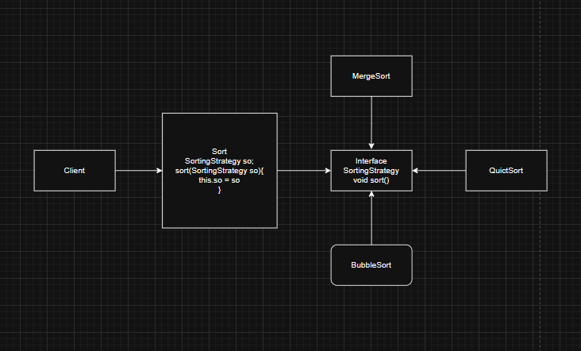
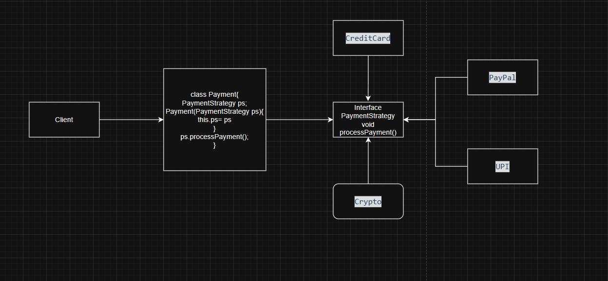

# Strategy Design Pattern

# Given Code 1

```java
class Sorter {
    void sort(int[] data, String type) {
        if (type.equals("bubble")) {
            System.out.println("Sorting using Bubble Sort");
        } else if (type.equals("quick")) {
            System.out.println("Sorting using Quick Sort");
        } else if (type.equals("merge")) {
            System.out.println("Sorting using Merge Sort");
        }
    }
}


class Main {
    public static void main(String[] args) {
        Sorter sorter = new Sorter();
        sorter.sort(new int[]{5, 3, 1}, "quick"); // hardcoded!
    }
}
```

# Diagram Following Strategy Pattern 1




# Refactored Solution 1

```java
class Sort{
    SortingStrategy so;
    Sort(SortingStrategy so){
        this.so = so;
    }
    void sort(){
        so.sort();
    }
}
interface SortingStrategy{
    void sort();
}
class BubbleSort implements SortingStrategy{
    void sort(){}
}

class QuickSort implements SortingStrategy{
    void sort(){}
}

class MergeSort implements SortingStrategy{
    void sort(){}
}
class Client{
    public static void main(String args[]){
        SortingStrategy so = new MergeSort();
        Sort sort = new Sort(so);
        sort.sort();
    }
}
```


# Give Code 2

```java
class PaymentService {
    void pay(String method, double amount) {
        if (method.equals("creditcard")) {
            System.out.println("Paying " + amount + " using Credit Card");
        } else if (method.equals("paypal")) {
            System.out.println("Paying " + amount + " using PayPal");
        } else if (method.equals("crypto")) {
            System.out.println("Paying " + amount + " using Crypto");
        } else if (method.equals("upi")) {
            System.out.println("Paying " + amount + " using UPI");
        }
    }
}

class Main {
    public static void main(String[] args) {
        PaymentService service = new PaymentService();
        service.pay("crypto", 500.0); // hardcoded!
    }
}
```

# Diagram Following Strategy Pattern 2



# Refactored Code 2

```java
class Payment{
    PaymentStrategy ps;
    Payment(PaymentStrategy ps){
        this.ps = ps;
    }
    void processPayment(){
        ps.processPayment();
    }
}
interface PaymentStrategy{
    void processPayment();
}

class CreditCard implements PaymentStrategy{
    void processPayment(){}
}
class Paypal implements PaymentStrategy{
    void processPayment(){}
}
class Crypto implements PaymentStrategy{
    void processPayment(){}
}
class UPI implements PaymentStrategy{
    void processPayment(){}
}

class Client{
    public static void main(String args[]){
        PaymentStrategy ps = new CreditCard();
        Payment payment = new Payment(ps);
        payment.processPayment();
    }
}

```

